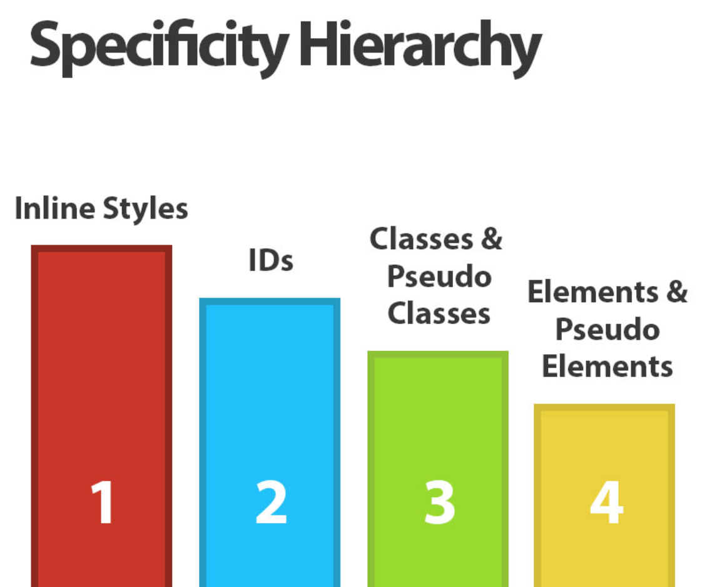
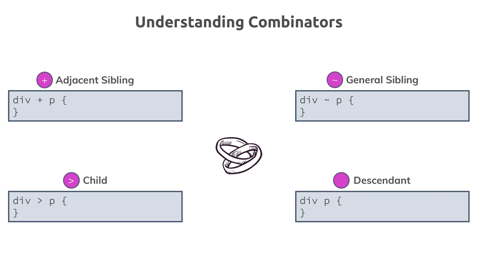
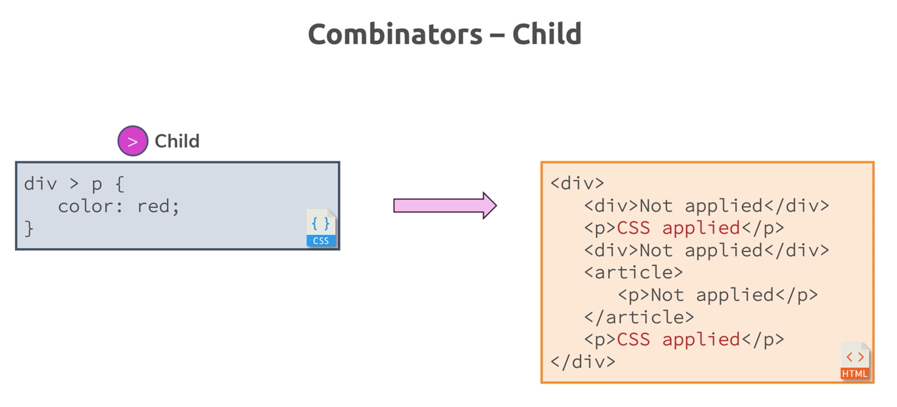
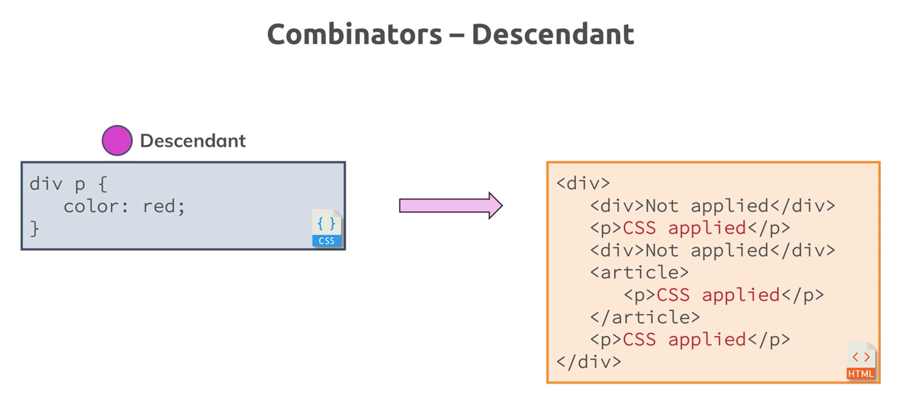
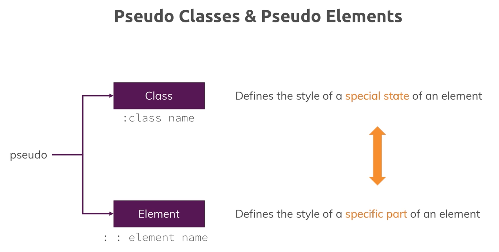
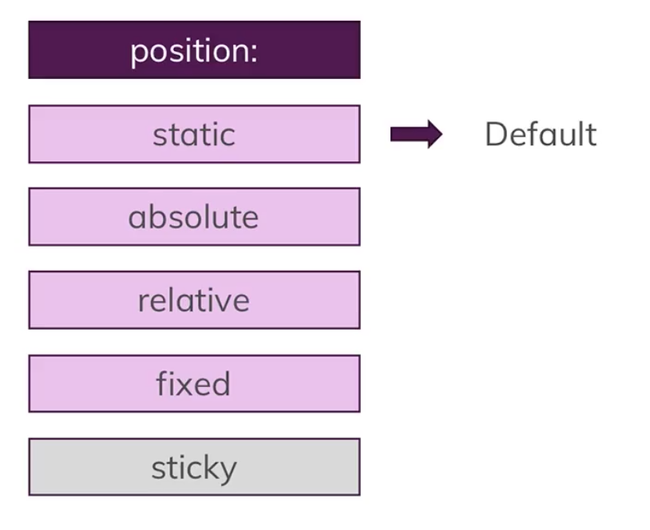
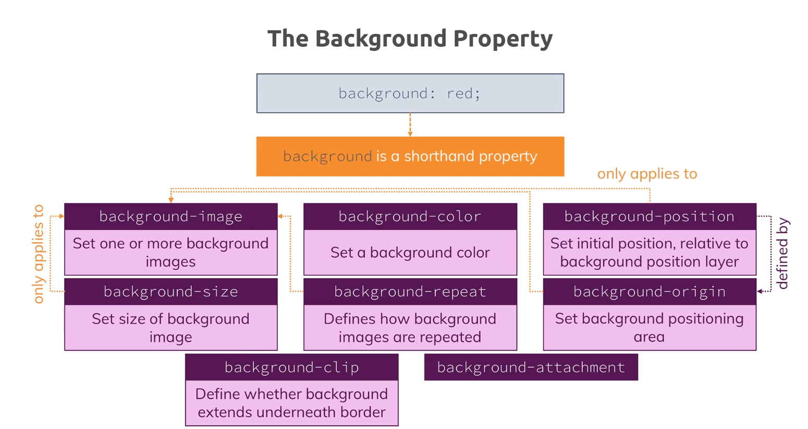
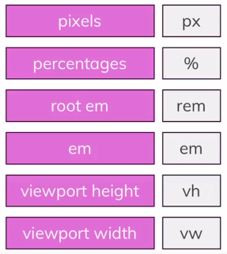
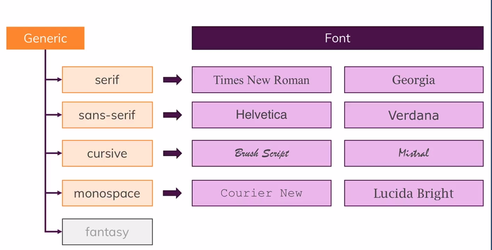

- CSS1 was introduced in 1996
- CSS2 was introduced in 1998
- CSS3 is a living standard like HTML5, so there would NOT be a CSS4.

# Selectors

## Specificity

 <br/>

## Combinators

 <br/>
 <br/>
 <br/>
 <br/>
 <br/>

# Pseudo classes & Pseudo elements

 <br/>

- [List of all pseudo classes](https://developer.mozilla.org/en-US/docs/Web/CSS/Pseudo-classes#Index_of_standard_pseudo-classes)
- [List of all pseudo elements](https://developer.mozilla.org/en-US/docs/Web/CSS/Pseudo-elements#Index_of_standard_pseudo-elements)

- `display: none` would remove element from document flow and hence from visibility, but the element would be there in DOM. Screen readers won't see them.
- when to use id / class ?
  - `id` should appear only once in a page, whereas `class` can appear in any numbers
  - `id` can be used to mark a specific section of HTML document (for eg: TOC in a page linking to different sections in that page)

# Box Model

 <br/>
 <br/>

- Every HTML element is a box. And, so every HTML element has box model properties such as width, height, padding, border & margin.
- Block elements take 100% width by default. So block level elements have a default CSS as `width:100%`
- Where is `width` set on the element ? Is that just on the content box or the box including content, padding and border of element. Width property by default is set on the content of the element. `box-sizing: content-box`. If you want to have width set on the entire content box + padding + border, use `box-sizing: border-box`.
- `inilne` elements occupy only the content size of element. Therefore, multiple inline elements can sit together in the same line. But, inline elements cannot have top & bottom margin. But, for `inline-block` elements, we can have elements arranged in the same line as well as set top & bottom margin as it's possible with a block elmement. `block` elements simply takes up the full width. So naturally two block elements don't sit next to each other in same line.
- `margin: auto` can be used to center a **block element** which has an **explicity width** set.

# Position

 <br/>

- In the **document flow**, default position of an HTML element is `position: static`. While in this default position, if you apply any position related CSS properties such as `top: 100px`, or `bottom: 15px` etc, it will not work. Because, in order for your positioning properties to work you should specifiy a position other than `static`.
- You can apply `position` property to either an **inline element** or a **block element**, and it works.
- `zindex` would work on any elements which has a position (other than static)

| Position value | Notes                                                                                                                                                                                                                                                                                                                                                                                                       |
| -------------- | ----------------------------------------------------------------------------------------------------------------------------------------------------------------------------------------------------------------------------------------------------------------------------------------------------------------------------------------------------------------------------------------------------------- |
| Static         | - Default positioning for every HTML5 elements. <br/> - This is the part of normal document flow.                                                                                                                                                                                                                                                                                                           |
| Fixed          | - The **positioning context** is viewport. <br/> - When you set the position values (such as top,right,bottom,left), then it is positioned in relation to viewport. And, they remain fixed - unaffected on scrolling the page.                                                                                                                                                                              |
| Absolute       | - The **positioning context** is nearest ancestor with a _position_ (other than static). <br/> - If there donot exist an ancestor with _position_, then **positioning context** fallbacks to `<html>` element. <br/> - In order to give a position to ancestor element, best try is to put `position : relative` to that ancestor element.                                                                  |
| Relative       | - The **positioning context** is same as that HTML element itself. <br/> - When you happen to push other elements around by applying a CSS like `margin-bottom`, then elements might break out of container. In that case apply `overflow:hidden` to parent container. <br/> - If parent container is `<body>` element, then you have to give `overflow: hidden` style to both `<body>` & `<html>` element. |
| Sticky         | - The **positioning context** is a hybrid of `fixed` and `relative` position. <br/> - A sticky positioned element behaves like a fixed element from `top : x px` from viewport, and it remains as fixed until the content of parent container is scrolled up above the viewport.                                                                                                                            |

# Background Image

- Background image doesn't follow normal document flow. So it is not read by screen readers too. But, it gives a lot of options to control the positioning and sizing of the image.

`background-image: url('pic.png')`

`background-size`

- `cover` will make sure that background image covers the container fully. Depending on aspect ratio some of the image may be cropped on longer axis.
- `contain` will make sure that whole background image is fit inside inside the container. Depending on aspect ratio there could be free space on shorter axis.
- `50%` will have only fill 50% of container with background image.

`background-position`

- `100px 50px` will make sure that background image is pushed 100px from left side of container, 50px from top of container.
- `left top` will make sure that the background image starts from the top left of container. Depending on aspect ration right-end/bottom-end of the image may be cropped.

 <br/>

# Image

- Unlike a background image, an image element sits in the normal document flow, but doesn't have much options to control the sizing and positioning like a background image.
- Setting a height or width for container elemnt of an img element doesn't help in sizing an image. It always consume the size of the actual image's height and width.
- To set a restricticted size for an image, set the height/width property on the img tag's CSS.

# Units

- What are the different units available in CSS ?
   <br/>
- Which are the CSS properties for which a unit does matter ?
-  <br/>
- How is size calculated ?
-  <br/>

## How does a percentage unit work ?

-  <br/>

- Relation of percentage unit to `position: fixed` of an element

While position of an element is fixed, then value of % unit of element property is determined in relation to `viewport`. So, the following CSS rules means that your element should take half width of your viewport.

```css
position: fixed;
width: 50%;
```

- Relation of percentage unit to `position: absolute` of an element

While position of an element is absolute, then value of % unit of element property is determined in relation to `parent container` which has a position (other than static). And, here the parent element's `content-width + padding` is considered in calculation.

- Relation of percentage unit to `position: static` or `position: relative` of an element

While position of an element is static or relative, then value of % unit of element property is determined in relation to `parent container` block element which has a position (other than relative). And, here the parent element's `content-width` alone (no padding) is considered in calculation.

- when a percentage value is given as size of an element, then you can give `max-width` or `max-height` to set the maximum size while expanding a screen.

- Giving font-size in `rem` and `em` units enables browser zoom in / zoom out of that text.

## Which unit is better fit for different CSS properties ?

-  <br/>

# Making site Responsive

1. At first set HTML5 meta tag `viewport` to instruct browsers to adjust pixel size according to device size.
   `<meta name="viewport" content="width=device-width, initial-scale=1.0">`
   `<meta name="viewport" content="width=device-width, initial-scale=1.0, user-scalable=yes, maximum-scale=2.0, minimum-scale=1.0">`
2. Secondly, add media queries to adjust CSS (including layout, color etc) according to device size.
   Mobile first design approach means you develop for mobile at first, and enhance your CSS using media queries to consider larger devices inlcuding desktops.

# Fonts

 <br/>

- Specify `font-family` needed for your website as a CSS, fallback it to **generic font-family**.
  `font-family: "Unknown, Verdana, sans-serif";`
  Here, _Unknown_ font is not available in user's computer, hence browser checks if _Verdana_ font is available. If that also fails, browser looks for default font configured for _sans-serif_ font-family .

- Another option is to use `web fonts` like google fonts.
- Another option is to localize fonts. Download a font into website folder, and import that to webpage like
  ```css
  @font-face {
    font-family: 'AnonymousPro';
    src: url('myFonts/AnonymousPro.ttf');
  }
  ```
- Font formats : `ttf`, `woff`, `woff2`
  check for browser support before using different font formats
